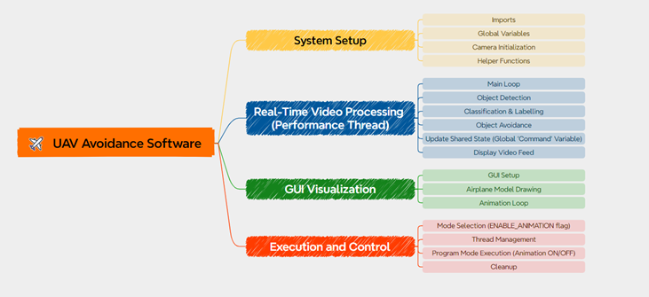
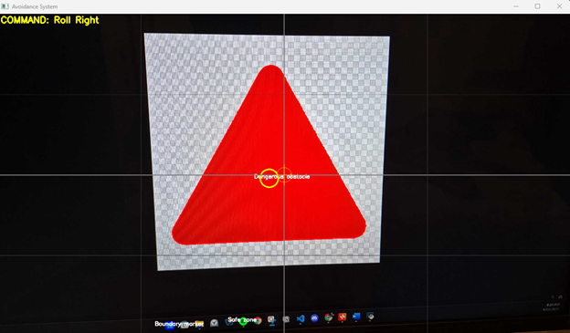
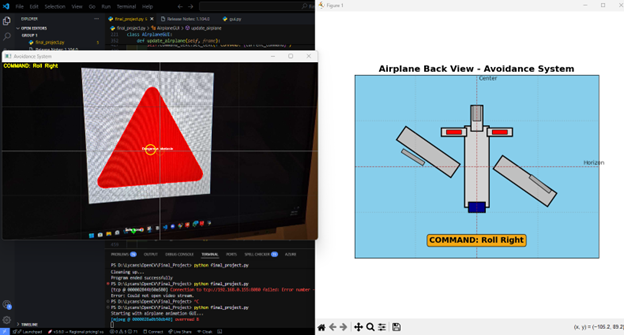

# ✈️ UAV Obstacle Avoidance System


A real-time computer vision system that detects obstacles and generates flight commands for obstacle avoidance, featuring both performance-optimized video processing and an interactive airplane animation GUI.

## 🎯 Overview

This system processes live video feed from an IP camera to detect and classify colored objects, then generates appropriate flight commands to avoid dangerous obstacles. The project includes a sophisticated airplane visualization that shows real-time aircraft responses to avoidance commands.

### Key Features

- **Real-time Object Detection**: Identifies colored shapes using HSV color space analysis
- **Intelligent Classification**: Categorizes objects as dangerous obstacles, boundary markers, or safe zones
- **Dynamic Avoidance Logic**: Generates roll and pitch commands based on obstacle proximity
- **Dual Execution Modes**: Performance mode for optimal processing or Animation mode with GUI
- **Interactive Airplane Visualization**: 3D-style airplane model with realistic control surface animations

<br>

<div align="center">
    
<br>
System Overview

</div>

## 📸 Demo Screenshots
<div align="center">
    
<br>
*Real-time detection of dangerous obstacles with avoidance commands* 

<br>

<br>
*Interactive airplane visualization showing roll and pitch responses*

</div>


## 🛩️ Object Classification System

<div align="center">
    
| Object Type | Color | Shape | Classification | Action |
|-------------|-------|-------|----------------|--------|
| **Dangerous Obstacle** | 🔴 Red | △ Triangle | High Priority Avoidance | Roll/Pitch commands generated |
| **Boundary Marker** | 🔵 Blue | ◻️ Square | Navigation Reference | Visual tracking only |
| **Safe Zone** | 🟢 Green | ● Circle | Safe Area | No avoidance needed |

</div>

## 🚀 Installation

### Prerequisites

```bash
# Python 3.7 or higher required
python --version
```

### Required Libraries

```bash
pip install opencv-python
pip install numpy
pip install matplotlib
pip install threading
```

### Hardware Requirements

- IP camera or webcam capable of streaming video
- Network connection to camera (if using IP camera)
- Sufficient processing power for real-time video analysis

## ⚙️ Configuration

### Camera Setup

1. Update the video stream URL in the code:
```python
video_url = "http://192.168.0.155:8080/video"  # Replace with your camera's IP
```

2. For local webcam, use:
```python
cap = cv2.VideoCapture(0)  # 0 for default camera
```

### Color Calibration

Adjust HSV color ranges in the `color_ranges` dictionary based on your lighting conditions:

```python
color_ranges = {
    'red': {
        'lower1': np.array([0, 120, 70]),    # Lower red hue range
        'upper1': np.array([10, 255, 255]),
        'lower2': np.array([170, 120, 70]),  # Upper red hue range  
        'upper2': np.array([180, 255, 255])
    },
    'green': {
        'lower': np.array([36, 100, 100]),   # Green range
        'upper': np.array([86, 255, 255])
    },
    'blue': {
        'lower': np.array([94, 120, 100]),   # Blue range
        'upper': np.array([126, 255, 255])
    }
}
```

## 🎮 Usage

### Execution Modes

The system offers two distinct operation modes:

#### 1. Performance Mode (Recommended for Production)
```python
ENABLE_ANIMATION = False
```
- Optimized for maximum processing speed
- Minimal resource usage
- Single OpenCV window display
- Best for real-world deployment

#### 2. Animation Mode (Development/Demonstration)
```python
ENABLE_ANIMATION = True
```
- Interactive airplane GUI with realistic animations
- Dual-window display (video + airplane visualization)
- Enhanced visual feedback
- Ideal for testing and demonstrations

### Running the System

```bash
python airplane_avoidance_system.py
```

### Controls

- **'q' key**: Exit the application
- **Window close**: Terminate all processes safely

## 🧠 System Architecture

### Core Processing Pipeline

1. **Video Capture**: Continuous frame acquisition from IP camera
2. **HSV Conversion**: Color space transformation for robust color detection
3. **Object Detection**: Contour analysis and shape classification
4. **Proximity Analysis**: Calculate distances to identify closest threats
5. **Command Generation**: Generate appropriate avoidance maneuvers
6. **Visual Feedback**: Display commands and aircraft response

### Avoidance Logic

```
IF dangerous_obstacle_detected:
    closest_obstacle = find_nearest_threat()
    
    IF horizontal_distance > vertical_distance:
        IF obstacle_right_of_center:
            COMMAND = "Roll Left"
        ELSE:
            COMMAND = "Roll Right"
    ELSE:
        IF obstacle_below_center:
            COMMAND = "Pitch Up"
        ELSE:
            COMMAND = "Pitch Down"
ELSE:
    COMMAND = "Clear"
```

## 🎨 GUI Features (Animation Mode)

### Airplane Visualization Components

- **Fuselage**: Main aircraft body with cockpit detail
- **Wings**: Dynamic roll movement with realistic proportions  
- **Control Surfaces**: 
  - Ailerons (roll control) - move differentially
  - Elevators (pitch control) - synchronized movement
  - Rudder (yaw control) - currently static
- **Visual References**: Horizon lines and center markers
- **Command Display**: Real-time command status with color coding

### Animation Characteristics

- **Smooth Interpolation**: Gradual movement transitions (120ms response time)
- **Realistic Physics**: Wing banking angles up to ±35 degrees
- **Control Surface Detail**: Separate aileron and elevator animations
- **Color-Coded Feedback**: 
  - 🟢 Green: Clear/Safe
  - 🟠 Orange: Roll maneuvers  
  - 🔴 Red: Pitch maneuvers

## 🔧 Technical Specifications

### Performance Metrics

- **Frame Rate**: ~30 FPS (Performance Mode)
- **Detection Latency**: <50ms
- **Min Object Size**: 400 pixels area
- **Color Detection**: HSV-based with dual-range red detection
- **Shape Accuracy**: Polygon approximation with 4% tolerance

### System Requirements

- **CPU**: Multi-core processor recommended
- **RAM**: 4GB minimum, 8GB recommended  
- **Network**: Stable connection for IP camera streaming
- **Display**: 1200x800 minimum resolution

## 🐛 Troubleshooting

### Common Issues

**Video Stream Connection Failed**
```
Error: Could not open video stream.
```
- Verify camera IP address and network connectivity
- Check if camera supports the streaming URL format
- Try using different video codecs or resolutions

**Poor Color Detection**
- Calibrate HSV ranges under current lighting conditions
- Ensure adequate contrast between objects and background
- Consider lighting improvements or camera settings adjustment

**Performance Issues**
- Switch to Performance Mode (`ENABLE_ANIMATION = False`)
- Reduce video resolution if possible
- Close unnecessary applications
- Check CPU usage during operation

### Optimization Tips

1. **Reduce Processing Load**:
   - Lower video resolution
   - Increase minimum contour area threshold
   - Disable GUI elements in performance mode

2. **Improve Detection Accuracy**:
   - Use controlled lighting environment
   - Ensure clear color contrast
   - Regular color range calibration

## 🔬 Advanced Configuration

### Custom Shape Detection

Modify the `detect_shape()` function to add new shape categories:

```python
def detect_shape(contour):
    # Add custom shape detection logic
    if len(approx) == 5:
        shape = "pentagon"
    elif len(approx) == 6:
        shape = "hexagon"
    # ... additional shapes
```

### Threading Optimization

For better performance, consider adjusting thread priorities:

```python
video_thread = threading.Thread(target=video_processing_thread, daemon=True)
video_thread.start()
```

## 📊 Project Structure

```
airplane_avoidance_system.py
├── Section 1: Setup & Configuration
├── Section 2: Shape Detection Functions  
├── Section 3: Core Video Processing
├── Section 4: Object Detection & Classification
├── Section 5: Obstacle Avoidance Logic
├── Section 6: Display & Visual Aids
├── Section 7-8: Airplane Animation Classes
├── Section 9: Threaded Video Processing
├── Section 10: Main Execution Controller
└── Section 11: Cleanup & Error Handling
```

## 🤝 Contributing

Contributions are welcome! Areas for improvement:

- Additional object shapes and colors
- Machine learning integration for better detection
- 3D visualization enhancements  
- Real hardware integration (drone/aircraft APIs)
- Performance optimizations
- Mobile platform support

## 🔗 Dependencies

- OpenCV 4.0+
- NumPy 1.19+
- Matplotlib 3.3+
- Python Threading (built-in)
- Math (built-in)

---

## 📄 License

This project is open-source. Please ensure responsible use, especially when integrating with real aircraft systems.

**⚠️ Safety Notice**: This system is designed for educational and simulation purposes. Any integration with real aircraft systems should undergo thorough testing and comply with aviation safety regulations.
